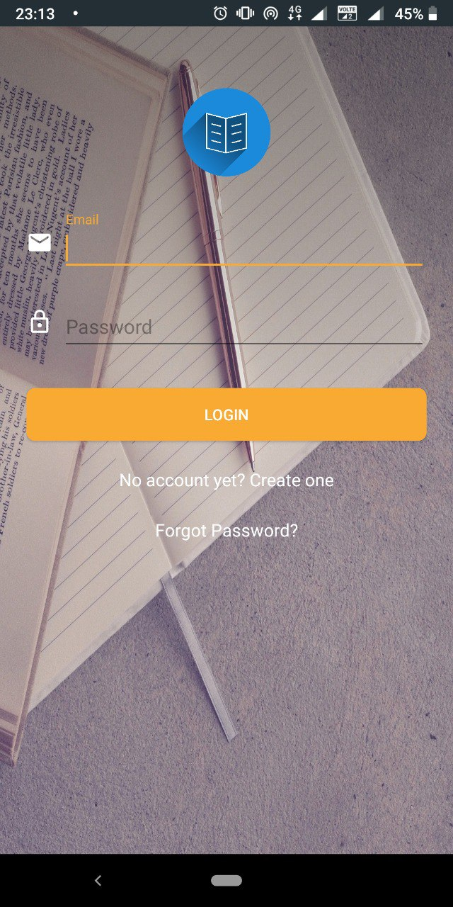
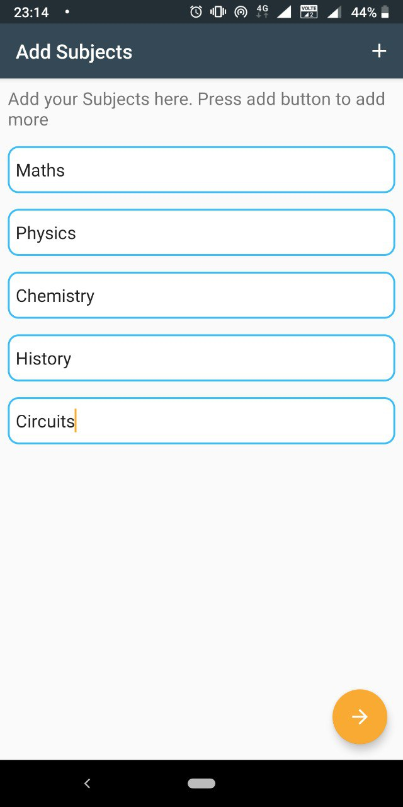
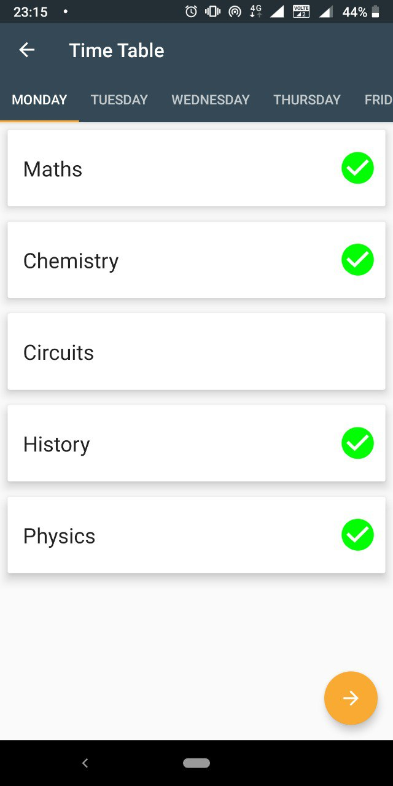
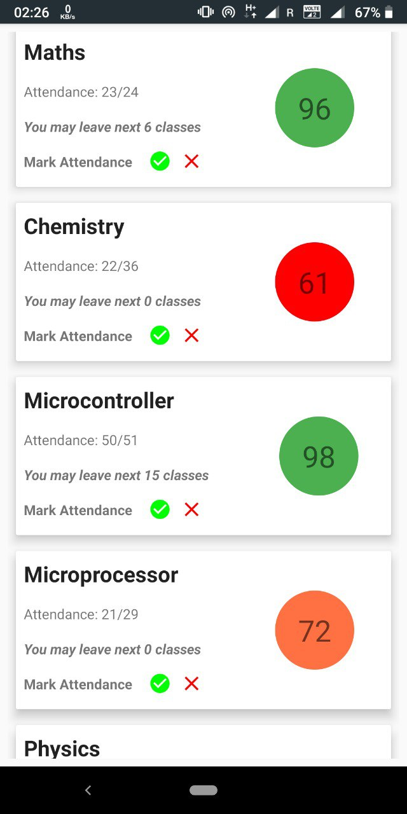
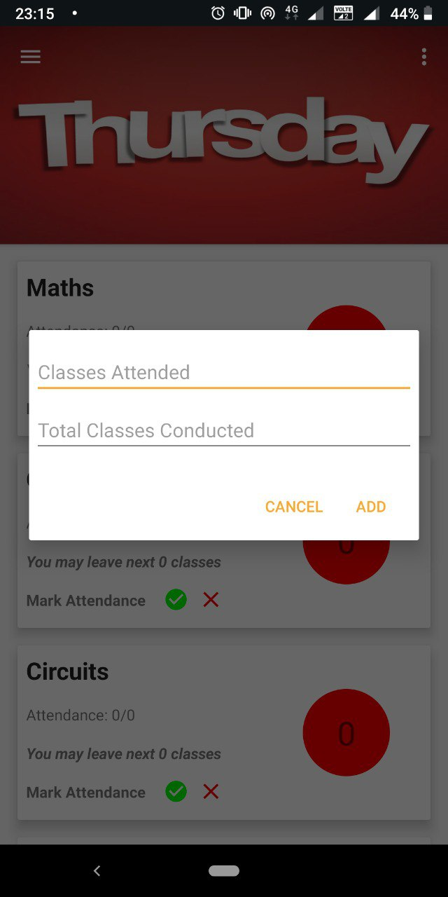
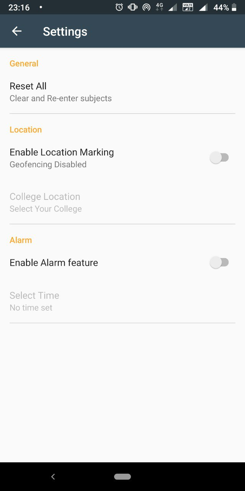

# Smart-Attendance-Manager

In many colleges in India and other countries, there is some attendance criteria in every subject to be eligible to pass the subject. Most of the colleges in India have 75% attendance rule and it becomes really difficult for students to keep track of their attendance in each and every subject. This app helps to solve that issue smartly and stores all of the information and keeps it updated with every class. This app will take all the subjects of the semester according to their time table, will take the class timings and will ask students after every class hour whether they attended the class to mark the attendance. There will also be a feature to turn on Smart feature which will make use of the Google’s geofencing library to detect whether the student goes to the college in that particular time and will update the attendance automatically. It will also have an alarm clock which can be enabled from settings. This alarm will fire before the first class every morning if the attendance becomes less than the minimum required criteria. 

## Screenshots

  <table>
    <tr>
     <td></td>
     <td></td>
     <td></td>
     <tr> 
      <td></td>
      <td></td>
      <td></td>
      <td></td>
    </tr>
  </table>
  
---

## Development Set up

* Add your Google Cloud API KEY in the Android manifest file.
 
* Replace the value "ENTER_API_KEY" with your own API key for Geolocation to work after development setup. Follow this guide to obtain the API_KEY - https://developers.google.com/maps/documentation/android-sdk/signup#get_an_api_key_from_the_console_name
